# 🏗️ CommCoach AI - Project Blueprint (C: Drive Root)

This document maps the implementation of the project located at `C:\Users\Hp\.gemini\antigravity\scratch\commcoach-ai`.

---

## 🏛️ High-Fidelity System Design

```mermaid
graph TB
    %% Definitions
    subgraph Root ["📁 Project Root: commcoach-ai"]
        direction TB
        
        subgraph FE ["🌐 Frontend Layer (React 19)"]
            f1["💻 Vite + TypeScript"]
            f2["🧪 Multi-modal Labs<br/>(Voice, Chat, Vision)"]
            f3["🎥 YouTube Mentor Hub"]
            f4["🤖 Meeting Intelligence"]
        end

        subgraph BE ["🚀 Backend Layer (Express)"]
            b1["🧠 Agent Orchestrator"]
            b2["🛡️ Security Middleware"]
            b3["📈 Antigravity Analyzer"]
            b4["📜 Route Controllers"]
        end

        subgraph DB ["🗄️ Database Layer (Supabase)"]
            d1["🐘 PostgreSQL (Profiles)"]
            d2["🧠 pgvector (Memory)"]
            d3["🔗 RLS Policies"]
        end
    end

    subgraph External ["🌐 Intelligence Cloud"]
        e1{{Google Gemini AI}}
        e2{{OpenAI Whisper}}
        e3{{ElevenLabs TTS}}
    end

    %% Flows
    f1 <-->|HTTPS / JWT| b1
    b1 <-->|Query/RAG| DB
    BE --->|API Req| External
    
    %% Styling
    classDef project fill:#667eea,stroke:#fff,stroke-width:2px,color:#fff;
    classDef secondary fill:#764ba2,stroke:#fff,stroke-width:2px,color:#fff;
    classDef data fill:#f8f9fa,stroke:#667eea,stroke-width:2px,color:#333;
    classDef cloud fill:#fff,stroke:#764ba2,stroke-width:2px,color:#333,stroke-dasharray: 5 5;
    
    class f1,f2,f3,f4 project;
    class b1,b2,b3,b4 secondary;
    class d1,d2,d3 data;
    class e1,e2,e3 cloud;
```

---

## 📁 Technical Roadmap Breakdown

### 1. **`frontend/`**
- **Core Technology**: React 19, TypeScript, Vite, Tailwind CSS.
- **Architectural Goal**: High-performance UI for real-time human-AI interaction.
- **Key Modules**:
  - `ChatWindow.tsx`: Real-time conversational interface.
  - `VisionLab.tsx`: Multi-modal image/file analysis.
  - `MeetingAgent.tsx`: Autonomous meeting intelligence.

### 2. **`backend/`**
- **Core Technology**: Express, Node.js.
- **Architectural Goal**: Secure agent orchestration and session intelligence.
- **Key Modules**:
  - `orchestrator.ts`: The central logic that routes intents to AI models.
  - `middleware/auth.js`: Secure JWT and Rate Limiting gatekeeper.
  - `antigravity/`: Advanced analysis engine for communication metrics.

### 3. **`database/`**
- **Core Technology**: Supabase (PostgreSQL + pgvector).
- **Architectural Goal**: Persistent, context-aware memory for all users.
- **Key Files**:
  - `schema.sql`: Core tables for profiles, sessions, and agents.
  - `rls-policies.sql`: Bank-grade Row Level Security isolation.

### 4. **`infrastructure/`**
- **Vercel**: Edge-optimized hosting for the Frontend.
- **Railway**: Scalable container deployment for the Backend.
- **GitHub Actions**: Automated CI/CD pipelines.
