# 🚀 CommCoach AI: The Creator's Blueprint

> **"From Local Code to Global Cloud"**  
> *A non-technical guide to how your digital empire works.*

---

## 🗺️ The 10,000 Foot View

Imagine your App Construction like a manufacturing pipeline. You design it locally, secure it in a vault, and then machines automatically build it and put it on stage for the world.

```mermaid
%%{init: {'theme': 'base', 'themeVariables': { 'primaryColor': '#ffffff', 'edgeLabelBackground':'#ffffff', 'tertiaryColor': '#f4f4f4'}}}%%
graph LR
    %% Styles
    classDef blue fill:#e0f2fe,stroke:#0284c7,stroke-width:2px;
    classDef gray fill:#f1f5f9,stroke:#64748b,stroke-width:2px;
    classDef green fill:#dcfce7,stroke:#16a34a,stroke-width:2px;
    classDef purple fill:#f3e8ff,stroke:#9333ea,stroke-width:2px;

    %% Nodes
    MY_PC("💻 YOUR STUDIO<br/>(Local Computer)"):::blue
    AGENTS("🤖 AI AGENTS<br/>(Your Team)"):::purple
    GITHUB("🛡️ THE VAULT<br/>(GitHub)"):::gray
    WORLD("🌍 THE STAGE<br/>(Cloud Hosting)"):::green

    %% Flow
    AGENTS -- "Helps write code" --> MY_PC
    MY_PC -- "Save & Push" --> GITHUB
    GITHUB -- "Auto-Deploys" --> WORLD
```

---

## 1. 💻 The Creative Studio (Local Development)
**"Where the magic happens."**

This is your personal computer (`C:\Users\Hp\...`). Think of this as your **Art Studio**.
*   **The Canvas:** Your code files.
*   **The Assistant:** **CommCoach Agents** (on your D: Drive). They live here with you. They help you paint, but they don't take the painting out of the studio—only *you* do that.
*   **The Action:** You and the AI build features here. It's safe; nobody sees mistakes until you're ready.

## 2. 🛡️ The Vault (GitHub)
**"The 'Save Game' slot for your business."**

When you are happy with the work in the Studio, you send it to **GitHub**.
*   **The purpose:** It keeps a perfect history of every change.
*   **The rule:** This is the single "Source of Truth." If your computer explodes tomorrow, your business is safe here.
*   **The trigger:** As soon as you update the Vault, a signal is fired: *"New version ready! Launch it!"*

## 3. 🚀 The Automation (CI/CD)
**"The Invisible Robots."**

You don't need to manually upload files to servers. Robots do it for you.
*   **The Flow:** 
    1. You push to GitHub.
    2. Robots wake up.
    3. They grab your code, check it for major errors, and verify it builds.
    4. If good, they send it to "The Stage."

## 4. 🌍 The Live Stage (Hosting)
**"Where your users visit."**

Your app splits into two parts to perform for the audience:

### 🎨 The Face (Frontend - Vercel)
*   **What it is:** The visual part users tap and click.
*   **Where it lives:** **Vercel**. Think of Vercel as a global network of billboards. It puts your interface everywhere in the world instantly so it loads fast.

### ⚙️ The Engine (Backend - Railway)
*   **What it is:** The heavy lifter. It processes audio, talks to Gemini AI, and handles logic.
*   **Where it lives:** **Railway**. Think of Railway as the engine room in the basement. Users don't see it, but the app doesn't work without it.

---

## 🔮 The Roadmap (Future Features)

Just like the image shows, we are building a path forward:

*   **🗄️ Q1 2026: The Memory Bank (Database)**
    *   *Now:* Browsers remember data temporarily (localStorage).
    *   *Next:* **Firebase**. A cloud database so users can log in from *any* device and see their history.
    
*   **📱 Q2 2026: Mobile Experience (PWA)**
    *   *Now:* It's a website.
    *   *Next:* An "App-like" experience that installs on phones.
    
*   **💰 Q3 2026: Monetization (Stripe)**
    *   *Next:* The cash register. Charging users for premium AI coaching features.

---

## 🔑 Key Takeaway for You
**You only worry about Step 1 (The Studio).**  
Once you and your AI Agents finish a feature and save it to the Vault (GitHub), the rest of the machinery (Robots, Vercel, Railway) handles the rest automatically.

You are the Director; the system is your crew. 🎬
