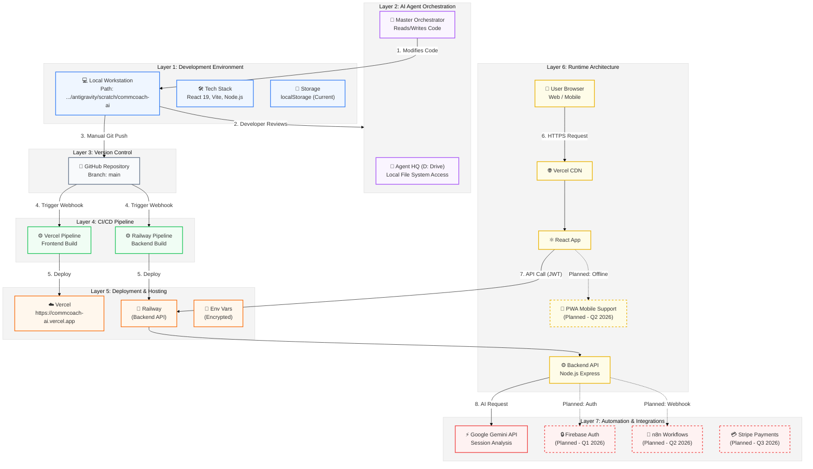

# 🏗️ CommCoach AI - 7-Layer System Architecture

## Architecture Diagram (Mermaid.js)

---

## 🗺️ Layer Description Mapping

| Layer | Color | Components | Status |
|:---|:---|:---|:---|
| **1. Development** | 🟦 Blue | Local Workstation, React/Node Stack, LocalStorage | ✅ Live |
| **2. AI Orchestration** | 🟪 Purple | Agent HQ (D:), Master Orchestrator, FileOps | ✅ Live |
| **3. Version Control** | ⬜ Gray | GitHub Repository (`main` branch) | ✅ Live |
| **4. CI/CD** | 🟩 Green | Vercel Pipeline, Railway Pipeline | ✅ Live |
| **5. Deployment** | 🟧 Orange | Vercel Hosting, Railway Hosting, Env Vars | ✅ Live |
| **6. Runtime** | 🟨 Yellow | Browser, CDN, API, PWA (Planned) | ⚠️ Mixed |
| **7. Automation** | 🟥 Red | Gemini API, Firebase (Planned), n8n (Planned) | ⚠️ Mixed |

## 🔑 Key Data Flow Sequence

1.  **User Input** 🗣️
    *   User records audio in Browser (Frontend).
2.  **Transmission** 📡
    *   React App sends transcript via HTTPS POST to Vercel/Railway.
3.  **Processing** ⚙️
    *   Railway Backend receives request, authenticates (future), and formats prompt.
4.  **Intelligence** 🧠
    *   Backend calls **Google Gemini API** (Layer 7).
5.  **Response** ↩️
    *   Insights returned to Backend -> Frontend -> User UI.

## 🛠️ Implementation Guidance

1.  **Orchestration Rule**: Agents (Layer 2) *never* push to GitHub (Layer 3) directly. They modify Layer 1, and the Human Developer bridges the gap to Layer 3.
2.  **Security Boundary**: Layer 6 (Runtime) communicates with Layer 7 (Integrations) only via Layer 5/6 Backend logic, never directly from client (except strictly public assets).
3.  **Future Proofing**: Dashed components (Firebase, PWA) in the diagram represent the Q1-Q3 2026 roadmap items.
